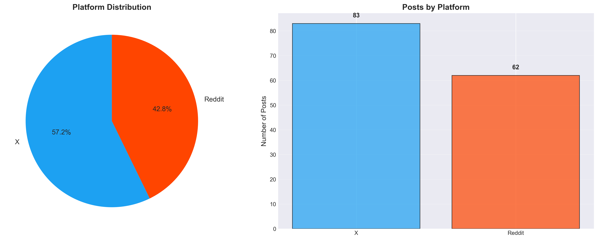

# 🚀 빠른 시작 가이드

## VSCode에서 5분 안에 시작하기

### ⚡ 가장 빠른 방법

1. **파일 다운로드**
   - `FINAL_COMMUNITY_DATASET_145.csv` ✅
   - `comprehensive_visualization.py` ✅

2. **VSCode에서 폴더 열기**
   ```bash
   File > Open Folder > (두 파일이 있는 폴더 선택)
   ```

3. **터미널 열기**
   ```
   Terminal > New Terminal (또는 Ctrl+`)
   ```

4. **실행!**
   
   **UV 환경 사용 중이라면:**
   ```bash
   uv run python comprehensive_visualization.py
   ```
   
   **일반 Python이라면:**
   ```bash
   python comprehensive_visualization.py
   ```

5. **결과 확인**
   - 같은 폴더에 10개 PNG 파일 생성됨
   - VSCode에서 이미지 미리보기로 확인

---

## 💻 플랫폼별 가이드

### 🍎 macOS

```bash
# 터미널에서
cd /path/to/outputs
chmod +x run_with_uv.sh
./run_with_uv.sh

# 결과 보기
open *.png
```

### 🐧 Linux

```bash
# 터미널에서
cd /path/to/outputs
chmod +x run_with_uv.sh
./run_with_uv.sh

# 결과 보기
xdg-open *.png
```

### 🪟 Windows

**방법 1: 배치 파일 (간단)**
1. `run_visualization.bat` 더블클릭
2. 완료!

**방법 2: PowerShell**
```powershell
cd C:\path\to\outputs
python comprehensive_visualization.py
```

**방법 3: CMD**
```cmd
cd C:\path\to\outputs
python comprehensive_visualization.py
```

---

## 🔧 문제 해결

### ❌ "Python not found"
```bash
# Python 설치 확인
python --version
python3 --version

# UV 사용
uv run python --version
```

### ❌ "No module named 'pandas'"
```bash
# 필요한 패키지 일괄 설치
pip install pandas numpy matplotlib seaborn wordcloud networkx scikit-learn textblob vadersentiment koreanize-matplotlib

# 또는 UV로
uv pip install pandas numpy matplotlib seaborn wordcloud networkx scikit-learn textblob vadersentiment koreanize-matplotlib
```

### ❌ "File not found: FINAL_COMMUNITY_DATASET_145.csv"
- CSV 파일과 Python 스크립트가 **같은 폴더**에 있는지 확인
- 또는 스크립트 15번 줄 경로 수정:
  ```python
  df = pd.read_csv('outputs/FINAL_COMMUNITY_DATASET_145.csv')
  ```

### ❌ "한글 폰트 오류"
```bash
# koreanize-matplotlib 설치
pip install koreanize-matplotlib

# 또는 스크립트에서 폰트 변경 (22번 줄)
plt.rcParams['font.family'] = 'DejaVu Sans'  # 영문 폰트 사용
```

---

## 📊 생성되는 파일 (10개)

| 파일 | 내용 | 크기 |
|------|------|------|
| `01_platform_distribution.png` | 플랫폼 분포 (파이+바) | ~300KB |
| `02_category_distribution.png` | 카테고리 분포 | ~250KB |
| `03_sentiment_analysis.png` | 감정 분석 | ~350KB |
| `04_time_period_distribution.png` | 시간대 분포 | ~280KB |
| `05_influence_score_analysis.png` | 영향력 4종 분석 | ~500KB |
| `06_wordclouds.png` | 워드클라우드 4종 | ~800KB |
| `07_keyword_heatmap.png` | 키워드 히트맵 | ~450KB |
| `08_keyword_cooccurrence.png` | 공동 출현 매트릭스 | ~400KB |
| `09_network_graph.png` | 작성자-카테고리 네트워크 | ~600KB |
| `10_comprehensive_dashboard.png` | 종합 대시보드 | ~700KB |

**총 용량**: ~4.5MB

---

## 🎯 체크리스트

실행 전:
- [ ] `FINAL_COMMUNITY_DATASET_145.csv` 파일 있음
- [ ] `comprehensive_visualization.py` 파일 있음
- [ ] 두 파일이 **같은 폴더**에 있음
- [ ] Python 3.11+ 설치됨
- [ ] VSCode 터미널 열려 있음

실행 후:
- [ ] 10개 PNG 파일 생성됨
- [ ] 오류 메시지 없음
- [ ] 이미지 정상 표시됨

---

## 💡 팁

### VSCode에서 이미지 빠르게 보기
1. 사이드바에서 PNG 파일 클릭
2. 또는 Markdown Preview로 확인:
   ```markdown
   
   ```

### 이미지 품질 높이기
스크립트에서 `dpi=300`을 `dpi=600`으로 변경

### 빠르게 재실행
터미널에서 위쪽 화살표 → Enter
(이전 명령어 재실행)

### 여러 파일 한번에 보기
- macOS: `open *.png`
- Linux: `xdg-open 01_platform_distribution.png &`
- Windows: 파일 탐색기에서 선택 후 Enter

---

## 📞 도움이 필요하신가요?

1. **README_VISUALIZATION.md** 전체 문서 참고
2. 스크립트 주석 확인 (각 섹션별 설명 있음)
3. 에러 메시지 전체를 복사해서 검색

---

## ⏱️ 예상 실행 시간

- 💻 일반 노트북: 1-2분
- 🚀 고성능 PC: 30초-1분
- 🐌 저사양: 2-3분

처음 실행 시 패키지 설치로 더 걸릴 수 있습니다.

---

**Happy Visualizing! 🎨📊**
